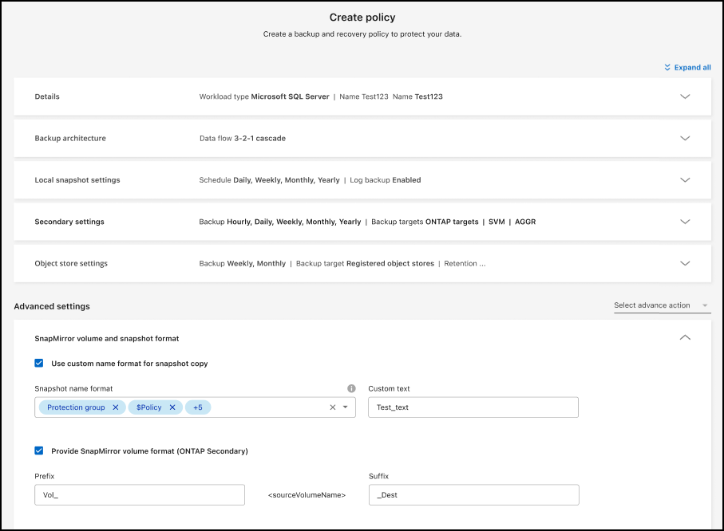

= Microsoft SQL Server ワークロードが一般提供 (GA) でサポートされるようになりました
:allow-uri-read: 

=== Microsoft SQL Server ワークロードが一般提供 (GA) でサポートされるようになりました

Microsoft SQL Server ワークロード サポートが、 NetApp Backup and Recovery で一般提供 (GA) されました。ONTAP、 Cloud Volumes ONTAP、 Amazon FSx for NetApp ONTAPストレージ上で MSSQL 環境を使用している組織は、この新しいバックアップおよびリカバリ サービスを利用してデータを保護できるようになりました。

このリリースには、以前のプレビュー バージョンからの Microsoft SQL Server ワークロード サポートに対する次の機能強化が含まれています。

* * SnapMirrorアクティブ シンク*: このバージョンでは、 SnapMirrorアクティブ シンク ( SnapMirror Business Continuity [SM-BC] とも呼ばれる) がサポートされるようになりました。これにより、サイト全体に障害が発生した場合でもビジネス サービスの運用が継続され、セカンダリ コピーを使用してアプリケーションが透過的にフェイルオーバーできるようになります。NetApp Backup and Recovery は、 SnapMirror Active Sync および Metrocluster 構成での Microsoft SQL Server データベースの保護をサポートするようになりました。情報は、保護の詳細ページの *ストレージと関係のステータス* セクションに表示されます。関係情報は、ポリシー ページの更新された *セカンダリ設定* セクションに表示されます。
+
参照 https://docs.netapp.com/us-en/data-services-backup-recovery/br-use-policies-create.html["ポリシーを使用してワークロードを保護する"]。

+
image:../media/screen-br-sql-protection-details.png["Microsoft SQL Server ワークロードの保護の詳細ページ"]

* *マルチバケットのサポート*: 異なるクラウド プロバイダーにまたがる作業環境ごとに最大 6 つのバケットを使用して、作業環境内のボリュームを保護できるようになりました。
* *SQL Server ワークロードのライセンスと無料トライアルの更新*: 既存のNetApp Backup and Recovery ライセンス モデルを使用して、SQL Server ワークロードを保護できるようになりました。SQL Server ワークロードには個別のライセンス要件はありません。
+
詳細については、 https://docs.netapp.com/us-en/data-services-backup-recovery/br-start-licensing.html["NetAppバックアップおよびリカバリのライセンスを設定する"] 。

* *カスタム スナップショット名*: Microsoft SQL Server ワークロードのバックアップを管理するポリシーで、独自のスナップショット名を使用できるようになりました。ポリシー ページの *詳細設定* セクションにこの情報を入力します。
+

+
参照 https://docs.netapp.com/us-en/data-services-backup-recovery/br-use-policies-create.html["ポリシーを使用してワークロードを保護する"]。

* *セカンダリ ボリュームのプレフィックスとサフィックス*: ポリシー ページの *詳細設定* セクションで、カスタムのプレフィックスとサフィックスを入力できます。
* *ID とアクセス*: ユーザーの機能へのアクセスを制御できるようになりました。
+
参照 https://docs.netapp.com/us-en/data-services-backup-recovery/br-start-login.html["NetAppバックアップおよびリカバリにログイン"]そして https://docs.netapp.com/us-en/data-services-backup-recovery/reference-roles.html["NetAppバックアップおよびリカバリ機能へのアクセス"]。

* *オブジェクト ストレージから代替ホストへの復元*: プライマリ ストレージがダウンしている場合でも、オブジェクト ストレージから代替ホストに復元できるようになりました。
* *ログ バックアップ データ*: データベース保護の詳細ページにログ バックアップが表示されるようになりました。バックアップが完全バックアップかログ バックアップかを示す「バックアップ タイプ」列が表示されます。
* *強化されたダッシュボード*: ダッシュボードにストレージとクローンの節約が表示されるようになりました。
+
image:../media/screen-br-dashboard3.png["NetAppバックアップおよびリカバリダッシュボード"]

=== ONTAPボリュームワークロードの強化

* * ONTAPボリュームの複数フォルダの復元*: これまでは、参照と復元機能から一度に 1 つのフォルダまたは複数のファイルを復元できました。NetApp Backup and Recovery では、参照と復元機能を使用して一度に複数のフォルダを選択できるようになりました。
* *削除されたボリュームのバックアップの表示と管理*: NetAppバックアップおよびリカバリ ダッシュボードに、 ONTAPから削除されたボリュームを表示および管理するオプションが追加されました。これにより、 ONTAPに存在しなくなったボリュームのバックアップを表示および削除できるようになります。
* *バックアップの強制削除*: 極端なケースでは、 NetApp Backup and Recovery がバックアップにアクセスできないようにする必要がある場合もあります。これは、たとえば、サービスがバックアップ バケットにアクセスできなくなった場合や、バックアップが DataLock で保護されているが不要になった場合に発生する可能性があります。以前は、これらを自分で削除することはできず、 NetAppサポートに連絡する必要がありました。このリリースでは、バックアップを強制的に削除するオプションを使用できます (ボリュームおよび作業環境レベル)。

CAUTION: このオプションは慎重に使用し、極端なクリーンアップが必要な場合にのみ使用してください。オブジェクト ストレージでバックアップが削除されていない場合でも、 NetApp Backup and Recovery はこれらのバックアップにアクセスできなくなります。クラウド プロバイダーにアクセスして、バックアップを手動で削除する必要があります。

参照 https://docs.netapp.com/us-en/data-services-backup-recovery/prev-ontap-protect-overview.html["ONTAPワークロードを保護する"]。
